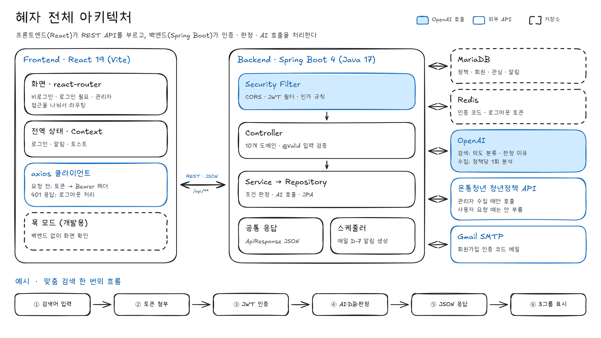
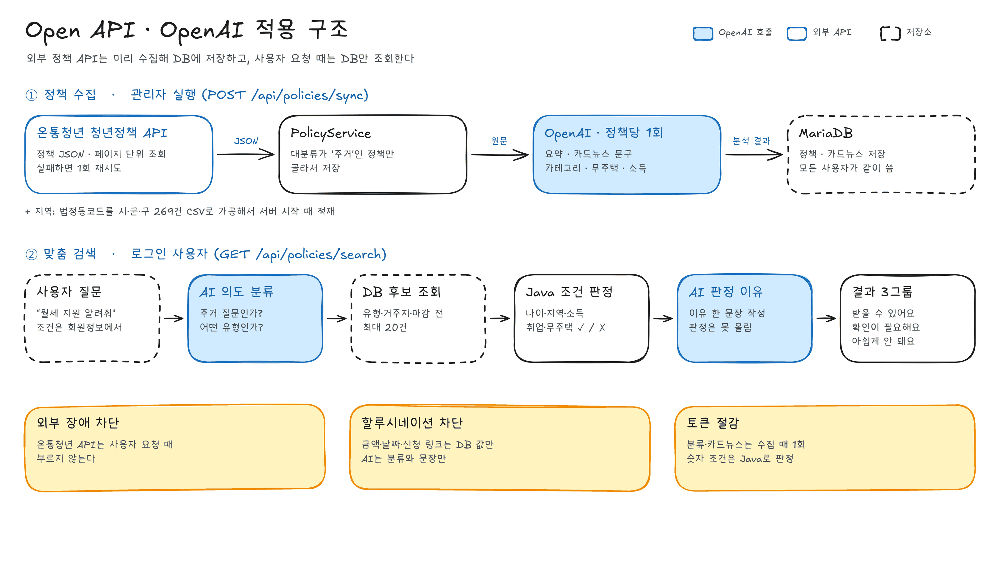
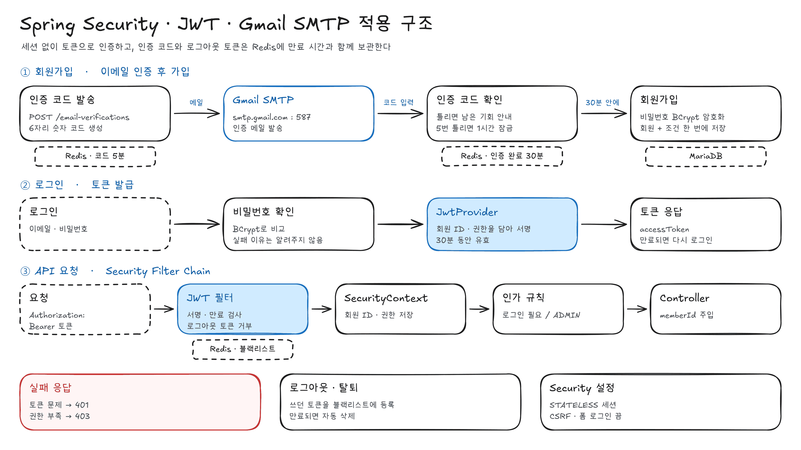
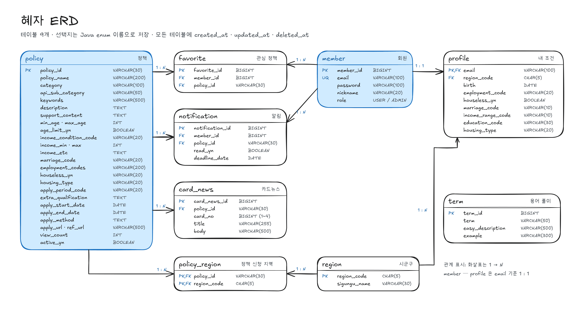

<div align="center">


# 혜자 (HYEJA)

**혜**택 + **자**격 — 내 조건에 맞는 청년 주거 정책을, 받을 수 있는지와 그 이유까지 알려주는 서비스

LG CNS AM Inspire 6기 미니프로젝트 1 · 7조 **혜자본주의**

<table align="center">
  <tr><th>Backend</th><th>Backend</th><th>Backend</th><th>Frontend</th><th>Frontend</th></tr>
  <tr><td align="center"><a href="https://github.com/yhi9839"></a></td><td align="center"><a href="https://github.com/GREED-YI"></a></td><td align="center"><a href="https://github.com/ljw2869"></a></td><td align="center"><a href="https://github.com/kimrim818-afk"></a></td><td align="center"><a href="https://github.com/eom-tae-in"></a></td></tr>
  <tr><td align="center"><a href="https://github.com/yhi9839">@yhi9839</a></td><td align="center"><a href="https://github.com/GREED-YI">@GREED-YI</a></td><td align="center"><a href="https://github.com/ljw2869">@ljw2869</a></td><td align="center"><a href="https://github.com/kimrim818-afk">@kimrim818-afk</a></td><td align="center"><a href="https://github.com/eom-tae-in">@eom-tae-in</a></td></tr>
</table>

[](https://github.com/Hyejabonjuui/frontend)
[](https://github.com/Hyejabonjuui/backend)

</div>

<br>

## 목차

1. [프로젝트 소개](#-프로젝트-소개)
2. [핵심 기능](#-핵심-기능)
3. [기술 스택](#-기술-스택)
4. [시스템 아키텍처](#-시스템-아키텍처)
5. [ERD](#-erd)
6. [폴더 구조](#-폴더-구조)
7. [실행 방법](#-실행-방법)
8. [테스트](#-테스트)
9. [협업 방식](#-협업-방식)

<br>

## 📌 프로젝트 소개

청년 주거 정책은 기관마다 흩어져 있고, 자격 조건과 용어가 어려워 내가 받을 수 있는지 판단하기 어렵습니다.
**혜자**는 나이·거주지·취업 상태 같은 조건을 **한 번만 등록**하면, 검색창에 필요한 것만 말해도("월세 지원 알려줘") 받을 수 있는 주거 정책을 찾아 줍니다.

- **조건별 충족 여부와 이유** — 결과를 `받을 수 있어요` / `확인이 필요해요` / `아쉽게 안 돼요` 세 그룹으로 나누고, 안 되는 이유까지 쉬운 말로 설명합니다.
- **신청까지 챙기는 흐름** — 관심 정책을 카드뉴스로 쉽게 보고, 신청 마감 7일 전에 알림을 받습니다.
- **할루시네이션 차단** — 정책명·금액·날짜·신청 링크는 DB 값만 사용하고, AI는 분류와 설명 문장만 담당합니다.
- **외부 장애 차단** — 온통청년 정책 API는 관리자 수집 때만 호출해 DB에 저장하고, 사용자 요청은 DB만 조회합니다.

<br>

## ✨ 핵심 기능

| 기능 | 설명 | 주요 API |
|---|---|---|
| 회원가입 · 로그인 | 이메일 인증 코드(Gmail SMTP) 확인 후 가입, JWT 로그인·로그아웃, 이메일 찾기, 탈퇴 | `/api/members/**`, `/api/members/email-verifications/**` |
| 내 조건 등록 · 수정 | 생년월일·거주지(시군구)·취업 상태·무주택 여부·혼인·소득 구간·학력·주거 형태 | `/api/members/me/profile`, `/api/regions` |
| 주거 정책 목록 · 상세 | 비로그인·로그인 목록, 주거 하위 유형(월세·전세·청약/구입·공공임대·기타) 필터, 상세 | `/api/policies/housing`, `/api/policies/housing/me`, `/api/policies/{policyId}` |
| **AI 맞춤 검색** | 질문 의도 분류(OpenAI) → DB 후보 조회 → 나이·지역·소득 등 조건별 ✓/✗ 판정(Java) → 문장 조건 판정 이유(OpenAI) → 3그룹 결과 | `/api/policies/search` |
| 카드뉴스 | 정책당 4장 문구를 수집 때 한 번 생성해 모든 사용자가 공유, 홈 추천 카드와 팝업 | `/api/policies/card-news`, `/api/policies/card-news/guest`, `/api/policies/card-detail/{policyId}` |
| 관심 정책 | ♡ 저장 · 해제 · 목록 | `/api/favorite` |
| 마감 알림 | 매일 00:05 관심 정책 마감 D-7 알림 생성, 읽음 처리 · 삭제 | `/api/notification` |
| 용어 풀이 | 중위소득·무주택세대구성원 등 어려운 용어를 쉬운 설명으로 | `/api/terms` |
| 관리자 | 온통청년 정책 수집(+AI 분석·카드뉴스 생성), 알림 수동 생성 | `/api/policies/sync`, `/api/notification/admin/generate` |

<br>

## 🛠 기술 스택

### Backend


-000000?style=for-the-badge&logo=jsonwebtokens&logoColor=white)


-EA4335?style=for-the-badge&logo=gmail&logoColor=white)
-85EA2D?style=for-the-badge&logo=swagger&logoColor=black)


| 구분 | 사용 기술 |
|---|---|
| Framework | Java 17, Spring Boot 4.1.1 (Web MVC), Validation, Lombok |
| Data | Spring Data JPA, MariaDB, Spring Data Redis, Jackson CSV (지역 코드 적재) |
| Auth | Spring Security, JWT (jjwt 0.13.0), Spring Mail (Gmail SMTP) |
| AI | OpenAI Java SDK (`com.openai:openai-java`) — JSON Schema 구조화 응답 |
| Docs | springdoc-openapi (Swagger UI) |
| Test · CI | JUnit 5, H2, Testcontainers (MariaDB · Redis), GitHub Actions |

### Frontend


| 구분 | 사용 기술 |
|---|---|
| Framework | React 19, react-router-dom 7, Vite 8 (Node 24 이상) |
| UI | MUI 9, Emotion |
| HTTP | axios |
| Test | Vitest, Testing Library, MSW, Playwright |
| Lint · Format | ESLint, Prettier |

### Tools


<br>

## 🏗 시스템 아키텍처

### 전체 구조

<picture>
  <source media="(prefers-color-scheme: dark)" srcset="docs/images/architecture/architecture-overview-dark.png">
  
</picture>

### 정책 수집 · AI 맞춤 검색

<picture>
  <source media="(prefers-color-scheme: dark)" srcset="docs/images/architecture/architecture-openapi-ai-dark.png">
  
</picture>

### 인증 · 보안

<picture>
  <source media="(prefers-color-scheme: dark)" srcset="docs/images/architecture/architecture-security-dark.png">
  
</picture>

- 세션 없이(STATELESS) JWT access token으로 인증하며, 토큰은 30분 동안 유효합니다.
- 이메일 인증 코드와 로그아웃한 토큰은 Redis에 만료 시간(TTL)과 함께 보관합니다.

<br>

## 🗂 ERD

<picture>
  <source media="(prefers-color-scheme: dark)" srcset="docs/images/erd/erd-dark.png">
  
</picture>

- 테이블 9개: `member` · `profile` · `region` · `policy` · `policy_region` · `card_news` · `favorite` · `notification` · `term`
- 모든 테이블은 `created_at` · `updated_at` · `deleted_at` 공통 컬럼(`BaseEntity`)을 가집니다.
- 선택지(취업 상태·소득 구간 등)는 공통 코드 테이블 대신 Java enum 이름으로 저장합니다. → [`docs/profile-policy-enums.md`](docs/profile-policy-enums.md)

<br>

## 📁 폴더 구조

```text
src
├── main
│   ├── java/com/hyeja
│   │   ├── domain                # 도메인별 controller · service · repository · entity · dto
│   │   │   ├── member            # 회원가입 · 이메일 인증 · 로그인
│   │   │   ├── profile           # 내 조건
│   │   │   ├── region            # 시군구 지역
│   │   │   ├── policy            # 정책 수집 · 목록 · 상세 · AI 맞춤 검색
│   │   │   ├── cardnews          # 카드뉴스
│   │   │   ├── favorite          # 관심 정책
│   │   │   ├── notification      # 마감 D-7 알림 · 스케줄러
│   │   │   └── term              # 용어 풀이
│   │   └── global
│   │       ├── apiPayload        # 공통 응답 ApiResponse
│   │       ├── baseEntity        # 생성·수정·삭제 시각
│   │       ├── config            # Security · Swagger · OpenAI · 스케줄링 등
│   │       ├── exception         # 전역 예외 처리
│   │       ├── security          # JWT · Security Filter
│   │       └── health            # 헬스체크
│   └── resources
│       ├── application.yml
│       ├── csv                   # 시군구 지역 코드
│       ├── db                    # 용어 시드 · 스키마 정리 SQL
│       └── mail                  # 인증 메일 템플릿
├── test                          # 단위 · Controller · Service · Repository 테스트
└── e2eTest                       # Testcontainers 기반 API E2E 테스트
```

<br>

## 🚀 실행 방법

### 사전 준비

- JDK 17
- MariaDB (`hyeja` 데이터베이스)
- Docker (로컬 Redis 실행용)

### 1. Redis 실행

```bash
docker compose up -d
```

### 2. 환경 변수

프로젝트 루트에 `.env` 파일을 만들고 아래 변수를 채웁니다. `.env`는 Git에 올리지 않습니다.
값을 넣는 방법은 [`docs/dev-seed.md`](docs/dev-seed.md)를 참고합니다.

| 구분 | 변수 |
|---|---|
| DB | `DB_HOST`, `DB_PORT`, `DB_NAME`, `DB_USERNAME`, `DB_PASSWORD`, `DB_SEED_MODE` |
| Redis | `REDIS_HOST`, `REDIS_PORT` |
| Server | `SERVER_PORT` |
| JWT | `JWT_SECRET` |
| Mail (선택) | `MAIL_USERNAME`, `MAIL_PASSWORD` |
| 외부 API | `YOUTH_API_KEY`, `OPEN_AI_KEY`, `OPEN_AI_MODEL` |
| 관리자 (선택) | `ADMIN_EMAIL`, `ADMIN_PASSWORD` |

### 3. 서버 실행

```bash
./gradlew bootRun
```

- API 문서(Swagger UI): `http://localhost:8080/swagger-ui.html`
- 헬스체크: `GET /api/health`
- 프론트엔드 실행 방법은 [frontend 저장소](https://github.com/Hyejabonjuui/frontend)를 참고합니다.

<br>

## 🧪 테스트

```bash
./gradlew test       # 단위·Controller·Service·Repository 테스트
./gradlew e2eTest    # Testcontainers 기반 핵심 API E2E 테스트
```

E2E 테스트는 Docker에서 MariaDB와 Redis를 자동으로 실행하므로 로컬 DB나 Redis를 따로 켤 필요가 없습니다.
검증하는 사용자 여정과 실행 환경은 [`docs/e2e-testing.md`](docs/e2e-testing.md)를 참고합니다.

PR을 올리면 GitHub Actions가 `test`와 `e2eTest`를 자동으로 실행합니다. → [`.github/workflows/ci.yml`](.github/workflows/ci.yml)

<br>

## 🤝 협업 방식

### 작업 흐름

```text
이슈 생성 → 이슈 브랜치 생성 → 개발 · 커밋 → git pull origin main → push → PR → 리뷰 · CI 통과 → merge
```

1. 모든 작업은 **이슈**부터 만듭니다. ([이슈 템플릿](.github/ISSUE_TEMPLATE/작업-이슈.md))
2. 이슈 화면의 `Create a branch`로 **1이슈 1브랜치**를 만듭니다.
3. push 전에 반드시 `git pull origin main`으로 최신 main을 반영합니다.
4. `main` 대상으로 PR을 올리고 이슈를 연결합니다(`Closes #번호`). ([PR 템플릿](.github/pull_request_template.md))
5. 디스코드에 PR을 공유하고, 리뷰 approve와 CI 통과 후 merge합니다.

### 컨벤션

| 구분 | 형식 | 예시 |
|---|---|---|
| 이슈 | `태그: 구현 내용 요약` | `feat: 청년 정책 목록 조회 API 구현` |
| 브랜치 | `태그/이슈번호/구현내용(영어)` | `feat/1/signup` |
| 커밋 | `태그 : 변경 내용` (콜론 앞뒤 공백) | `fix : 관심 정책 중복 등록 오류 수정` |

| 태그 | 사용하는 경우 |
|---|---|
| `feat` | 새로운 기능 추가 |
| `fix` | 버그 수정 |
| `refactor` | 동작 변경 없이 구조 개선 |
| `docs` | 문서 추가 · 수정 |
| `test` | 테스트 코드 |
| `style` | 정렬 · 공백 등 형식 |
| `chore` | 환경 설정 · 의존성 · 협업 도구 |

자세한 내용은 [`docs/development-workflow.md`](docs/development-workflow.md)를 참고합니다.

